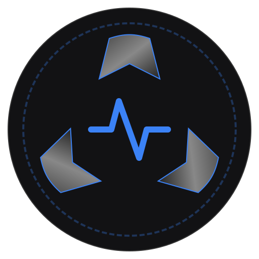

# DSPCLAW

 Faust DSP programming, featuring an embedded AI agent powered by the Model Context Protocol (MCP).



## 🚀 What this is

DSPCLAW is a sandbox for exploring AI-assisted Faust code generation. It allows you to describe audio synthesizers and effects in natural language, and an AI agent will autonomously write, compile, and render a photorealistic VST-style UI directly in your browser or on your desktop.

### Key Features

- **Embedded AI Agent:** Uses `@modelcontextprotocol/sdk` to give LLMs direct access to read, write, and compile your DSP code.

- **UI:** Automatically generates photorealistic control surfaces based on Faust metadata (`[style:knob]`, `[unit:Hz]`).
- **Cross-Platform:** Runs as a native desktop app (macOS/Windows) via Electron, or directly in the browser via Web/Vercel.


## ⚙️ Getting Started (Development)

### Prerequisites
- Node.js (v20+ recommended)
- An API Key from OpenAI, Anthropic, or Moonshot (or a custom OpenAI-compatible endpoint).

### Installation
```bash
git clone https://github.com/YOUR_GITHUB_USERNAME/YOUR_REPO_NAME.git
cd faust
npm install
```

### Running the App
You can run DSPCLAW in two modes:

**1. Desktop Mode (Electron - Recommended)**
Provides the full experience, including native window controls, secure keychain storage, and CORS bypass.
```bash
npm run electron:dev
```

**2. Web Mode (Vite)**
Runs entirely in the browser. Best for quick UI tweaks or deploying to the web.
```bash
npm run dev
```

## 📦 Building & Packaging

To package the application for distribution:

**Build for macOS & Windows (ZIPs):**
*(Note: Requires a macOS environment to build DMG/Mac ZIPs)*
```bash
npm run electron:build:all
```
The output will be located in the `release/` directory.

**Build for Web (Static HTML/JS):**
```bash
npm run build
```

## 🤖 AI Prompting Tips

The embedded assistant is instructed to **Analyze & Plan** before writing code.
Try the default "Moog Synthesizer" quick-prompt or custom requests like:
- *"Add a stereo phaser after the current filter while keeping my keyboard mappings."*
- *"Look at the code and add a high-shelf EQ at the end of the chain."*

## 🛠 Tech Stack
- **Frontend / Renderer:** React 19 + Vite + TypeScript
- **Desktop Container:** Electron + `vite-plugin-electron`
- **State Management:** Zustand (Single source of truth for code, AudioContext, and nodes)
- **DSP Engine:** `@grame/faustwasm` (FaustPolyDspGenerator & FaustMonoDspGenerator)
- **Editor:** `@monaco-editor/react`


## ⚠️ Requirements
- **Audio Gesture:** Modern browsers require user interaction to start the WebAudio context. You must click **"START ENGINE"** in the header to activate sound.

## Licensing & Credits
- **Engine:** Faust compiler and libraries are copyright © GRAME-CNCM.
- **License:** GPL-3.0. See [LICENSE](LICENSE).