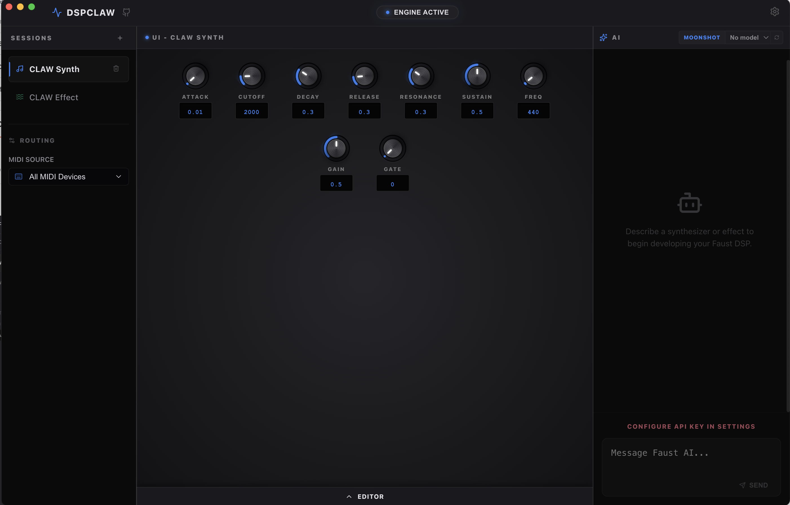

# DSPCLAW

Faust DSP programming, featuring an embedded AI agent.



[**🌐 Live Web Demo**](https://dspclaw.vercel.app/) | [**📦 Download Latest Release (Mac/Win)**](https://github.com/lmaxwell/dspclaw/releases/latest)

## 🚀 What this is

DSPCLAW is a sandbox for exploring AI-assisted Faust code generation. It allows you to describe audio synthesizers and effects in natural language, and an AI agent will autonomously write, compile, and render a photorealistic VST-style UI directly in your browser or on your desktop.

## ✨ Key Features

- **Embedded AI Agent**: the agent can read, write, and compile Faust code based on your requirements.
- **Industry-Level VST UI**: Photorealistic control surface with radial knobs, LED tracking rings, and hierarchical grouping.
- **Polyphonic MIDI**: Full support for MIDI controllers and computer keyboard mappings.
- **Live MIDI Visualization**: Real-time display of active MIDI notes and signal processing.
- **Adaptive Interface**: VST modules and controls intelligently scale and stack to fill the workspace.
- **Audio Input Reference**: Route external WAV loops through your DSP chains for testing effects.

## 🛠 Tech Stack

- **Frontend**: React + Vite + TypeScript
- **Desktop**: Electron
- **DSP Engine**: [@grame/faustwasm](https://github.com/grame-cncm/faustwasm)
- **Layout**: Allotment (resizable panes)
- **Editor**: Monaco Editor

## 🚀 Getting Started

### Prerequisites

- [Node.js](https://nodejs.org/) (v20 or higher)
- An API Key from OpenAI, Anthropic, or Moonshot (or a custom OpenAI-compatible endpoint).

### Installation

1. Clone the repository:
   ```bash
   git clone https://github.com/lmaxwell/dspclaw.git
   cd dspclaw
   ```

2. Install dependencies:
   ```bash
   npm install
   ```

3. Start development server:
   - For Web: `npm run dev`
   - For Electron: `npm run electron:dev`

### Usage

1. Open the **Settings** panel (gear icon) and enter your API Key.
2. Click **START ENGINE** in the header to activate WebAudio.
3. Use the Chat panel to ask the AI to build or modify a DSP processor.
4. Play notes using your MIDI controller or computer keyboard (A, W, S, E, D, F, T, G, Y, H, U, J, K).

## 📖 Building for Production

- Web build: `npm run build`
- Electron build: `npm run electron:build`

## 📄 License

This project is licensed under the MIT License - see the [LICENSE](LICENSE) file for details.

## 🤝 Contributing

Contributions are welcome! Please feel free to submit a Pull Request.
